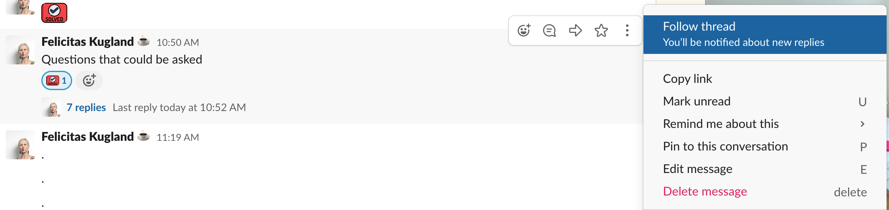
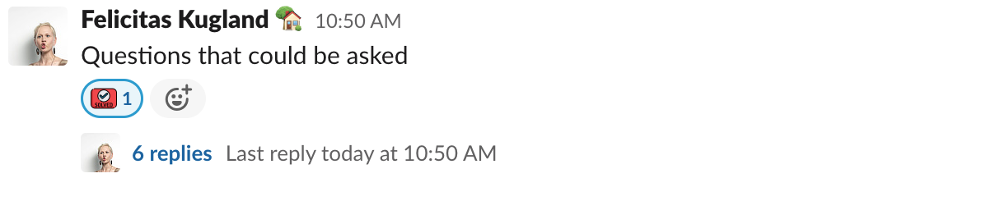
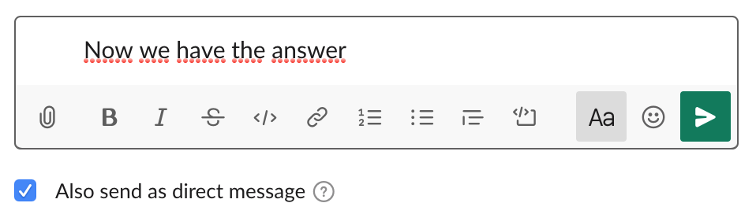
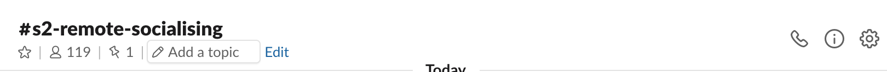
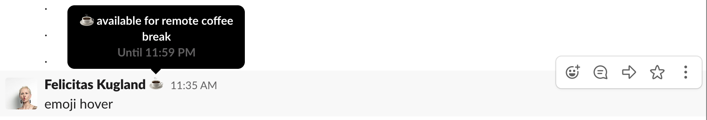
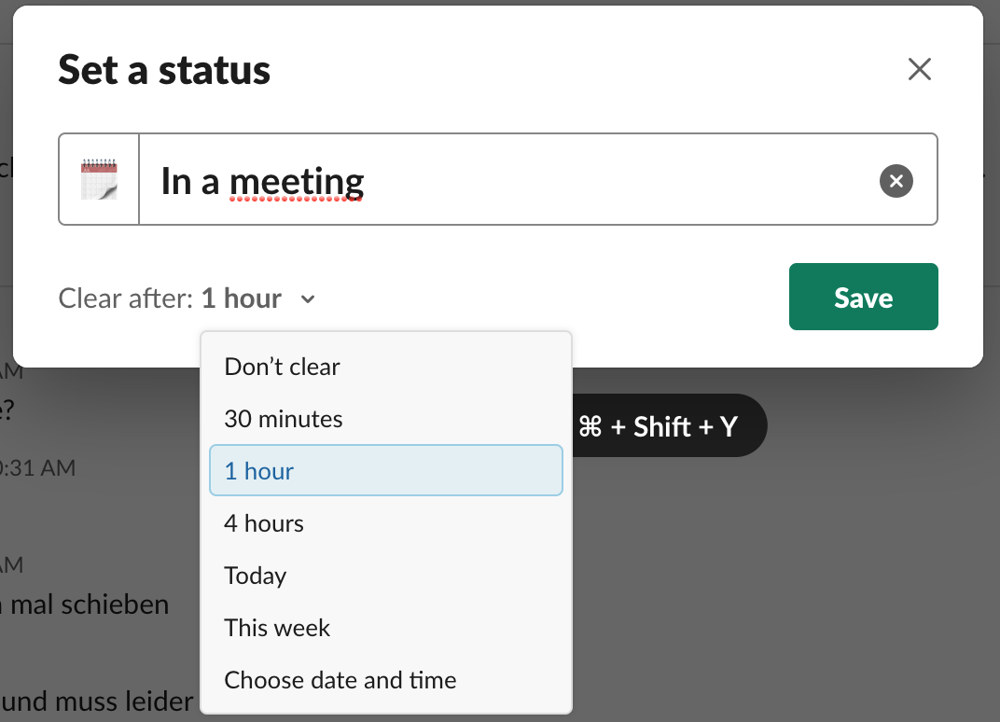

# Slack Communication Etiquette

With a remote by default approach these days, more communication will follow on Slack. It’s time for us to establish a Slack Communication Etiquette.
Chat can be problematic. This manifesto should help us to communicate better over Slack.

> We don't expect you to monitor Slack every minute.
> Please be aware that responses can be async.

Overall communication should take place in group channels so that everyone in your team has the same status/information. Be transparent. Be kind.

## Fewer Notifications Means Fewer Disruptions

With people working across different studios, projects and times (colleagues who need to watch after people - for example parents after their kids) it is important to open Slack not to "238" unread messages. How to make fewer notifications? Sent fewer messages! How? Look below!

### One message - one notification
For every message you send in Slack other people will get a notification. Instead of sending one message per line try to get everything you need into a single message. For example don’t start with sent only “hey” or “hello”, make it a first line of your message.

> 💡 Tip: To draft a message with multiple paragraphs, press ctrl+return or shift+return to create line breaks.

### Use threads

Use threads whenever possible. If you answer a question or have a comment please do so in a thread. This way people can scan 10 threads and decide if they're interested. This saves everybody time.

> 💡 Tip: You can even subscribe/unsubscribe. Click the message "Follow thread".
>
> 

### Mark your thread with emojis

In case your thread was a question and answered, mark it with the ":solved:" emoji (see screenshot below). There may be lots of discussions ongoing in a thread. Often not everybody being interested in the answer, needs to follow the discussions. When you found the answer to your question mark it as solved so that people know to find answers without reading everything.

### Share the result of the thread (optional)

If you think a message or answer is valuable for the team, feel free to cross-post it back to the channel. Please be careful with that. You're in a discussion and have context around it. Ask yourself: Will people get it or do they have to go and read the whole thread? If it's out of context, try to sum up the problem and answer in a single thread message and cross-post this one instead.

### Use of @here and @channel

Use aliases (@name) of your colleagues first, if you need to reach everyone **be aware** of the notification and the difference between @here, @channel and @everyone.
* **@here** notifies only the [active members](https://slack.com/help/articles/201864558-Set-your-Slack-status-and-availability#availability-in-slack) of a channel
* **@channel** notifies all members of a channel, [active or not](https://slack.com/help/articles/201864558-Set-your-Slack-status-and-availability#availability-in-slack)
* **@everyone** notifies every person in the [#general channel](https://slack.com/help/articles/220105027-The-general-channel)

> 💎 Hint: If your Slack Team has renamed the general channel, mention it.

### Use the right channel for your Message

Channels vary in size and we should think about the importance of a message. Are your questions regional, could they be solved in your project/ team channel or do all members of the Slack Workspace have to see it? Consider carefully how many people need your attention.
For getting a better understanding if it’s the right channel, read the [channel topic and description](https://slack.com/intl/en-de/help/articles/201654083-Set-a-channel-topic-or-description).
Of course that means we should have a channel topic and description in every channel and maintain it. If there is no channel topic or description, talk to the channel team and decide which description would fit best and set it up.

Try to stay transparent. **A**way **F**rom **K**eyboard for lunch? Done for the day? Let your project/ team mates know in your dedicated channel (see also Status).

### What you could do yourself to reduce your notifications

- Use Do Not Disturb feature
  - **pause** during the day to block off distraction-free hours when you’re focused on your work
  - **schedule** to set automatically disable notifications times
- Channels
  - leave or mute channels which are not important for you or your work
  - set channel specific notification handling

[Learn more about notifications](https://slack.com/intl/en-de/help/articles/201355156-Guide-to-desktop-notifications)

## Be Kind - Use Emojis To Show Attention

Nothing is more frustrating than post a question to a channel with 100 people and not get a response. If you read a message but have no answer or nothing to say, please acknowledge that you've seen it.

## Be Transparent - Set Status

Meetings, workshops, lunch, vacation, …. It's hard to tell when someone is available. Use your status to tell your colleagues how you can be approached. Keep your status up to date and respect your colleagues' status. For example:

- 💨afk (**a**way **f**rom **k**eyboard)
- 🗓In a meeting
- 🍝Lunch
- 🌴Vacationing until 14th April
- 🤒Out sick
- ⛔️DND until 4:30pm
- ☕️available for remote coffee break
- ...

Don’t forget to let your team(s) know when you start to work, leave for the end of your working day or you are **A**way **F**rom **K**eyboard.

> 💡 Tip: By mouse over, over the emoji of someone's status you can see the massage.
> 

> 💡 Tip: You can schedule the time for the status so it’s automatically clear after Xh.
> 

## Add Apps, Integrations, Channels

Do you want to optimise your work or the communication in slack? You need a channel for your team, project, Skill Group? Nice!

> 💎 Hint: In a lot of companies not everyone has the permission to do so, get in contact with your "User help desk", they are happy to help.

## Did You Know That? Tips & Tricks

### /remind

Can be used to set a reminder for you own or a channel. Syntax: **/remind [who][what][when]**. [Learn more about remind](https://slack.com/intl/en-gb/help/articles/208423427-Set-a-reminder)

### Keywords Notifications

You can add keywords to your profile & preferences and anytime someone use one of your keywords in a channel you’ve joined you’ll receive a notification.
[Further information about keywords](https://slack.com/intl/en-gb/help/articles/201398467-Set-up-keyword-notifications)

### Tidy up your feed

Type /collapse to hide all image previews in the current channel and /expand to bring them back.

### Workflow builder
Do you know workflow builder? It's a fantastic new feature from Slack which can help you with:
- Quickly collect information from team members (e.g. with a survery / form)
- Standardise recurring project updates (e.g. daily reminders for stand ups)
- Automatically welcome members to channels (e.g with a Direct Message or with a channel message)
- ... tons of more possibilites

[Learn how to use the Workflow builder](https://slack.com/intl/en-gb/help/articles/360035692513-Guide-to-Workflow-Builder)

### More tips and tricks

- can be found at the slack website [here](https://slack.com/intl/en-de/help/categories/360000049063-tips-tricks-more#tips-tricks)
- [and here](https://slack.com/intl/en-gb/slack-tips)
